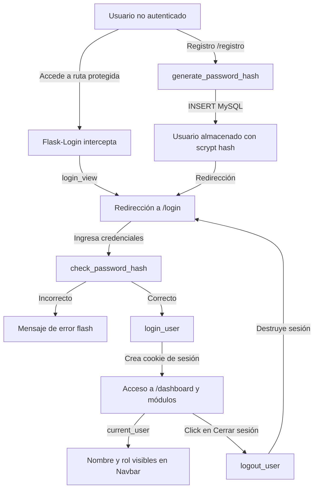

# Proyecto Integrador U4 - Avance 14/16: Implementación de un Sistema de Login Funcional

**Asignatura:** Desarrollo de Aplicaciones Web  
**Curso:** 2626-UEA-L-UFPTI-004-D  
**Semana:** 14 (Unidad 4: Gestión de Datos y Desarrollo de la Aplicación Web)  
**Estudiante:** Clara Anahí González Apolo  
**Tema:** Ferretería "El Tornillo Dorado"  
**Despliegue Frontend (GitHub Pages):** [https://anis1605.github.io/2626-UEA-L-UFPTI-004-D-Semana14/](https://anis1605.github.io/2626-UEA-L-UFPTI-004-D-Semana14/)  
**Repositorio GitHub:** [https://github.com/anis1605/2626-UEA-L-UFPTI-004-D-Semana14](https://github.com/anis1605/2626-UEA-L-UFPTI-004-D-Semana14)

---

## 📌 Descripción del Avance

En este avance de la **Semana 14**, el Proyecto Integrador incorpora un **sistema de autenticación y control de sesiones funcional**, integrado directamente con la base de datos relacional **MySQL** y el framework web **Flask**.

El sistema permite el registro de nuevos usuarios, almacenamiento seguro de credenciales mediante funciones de hash criptográfico (**Werkzeug**), inicio de sesión con validación de credenciales, persistencia de sesión con **Flask-Login**, protección de páginas privadas y administrativas mediante el decorador `@login_required`, identificación del usuario activo en la interfaz mediante `current_user` y cierre de sesión seguro (`logout_user`).

---

## 🛠️ Tecnologías y Dependencias

- **Lenguaje:** Python 3.12
- **Framework Web:** Flask 3.1.3
- **Autenticación y Sesiones:** Flask-Login 0.6.3
- **Seguridad y Cifrado:** Werkzeug 3.1.8 (`generate_password_hash`, `check_password_hash`)
- **Formularios & Validaciones:** Flask-WTF 1.3.0 / WTForms 3.2.2
- **Motor de Base de Datos:** MySQL 8.0+ (`ferreteria_db`)
- **Conector:** `mysql-connector-python` 26.7.0
- **Testing:** `pytest` 9.1.1
- **Frontend:** Jinja2, Bootstrap 5.3, Bootstrap Icons, CSS3 y JavaScript interactivo
- **Control de Versiones y Despliegue:** Git, GitHub, GitHub Pages

---

## 🔐 Flujo del Sistema de Autenticación



1. **Registro:** Formulario validado con Flask-WTF (`RegistroUsuarioForm`). Valida contraseñas coincidentes y unicidad del usuario.
2. **Hash:** Transformación de la contraseña en texto plano mediante `generate_password_hash(password, method='scrypt')`. Nunca se almacena texto plano.
3. **Login:** Validación con `check_password_hash(usuario.password, password_ingresado)`.
4. **Sesión:** Manejo centralizado con `LoginManager`, inicializando la sesión mediante `login_user()`.
5. **Protección:** Decorador `@login_required` en rutas de `/dashboard`, `/productos`, `/clientes`, `/proveedores`, `/facturacion` y sus operaciones CRUD.
6. **Logout:** Finalización segura con `logout_user()` y redirección inmediata a `/login`.

---

## 🗄️ Esquema de la Tabla de Usuarios (`sql/esquema.sql`)

```sql
CREATE TABLE IF NOT EXISTS usuarios (
    id INT AUTO_INCREMENT PRIMARY KEY,
    usuario VARCHAR(50) UNIQUE NOT NULL,
    password VARCHAR(255) NOT NULL,
    nombre VARCHAR(100) NOT NULL DEFAULT '',
    rol VARCHAR(20) NOT NULL DEFAULT 'admin',
    fecha_creacion TIMESTAMP DEFAULT CURRENT_TIMESTAMP
) ENGINE=InnoDB DEFAULT CHARSET=utf8mb4 COLLATE=utf8mb4_unicode_ci;
```

### Usuarios Iniciales de Demostración (Contraseñas Hasheadas):
| Usuario | Contraseña Plano | Hash Almacenado (Preview) | Rol |
|---|---|---|---|
| `admin` | `admin123` | `scrypt:32768:8:1$rpEacFlUi0WEiBZQ...` | admin |
| `anis` | `ferreteria2026` | `scrypt:32768:8:1$nRKnSxNJhQjGMw2K...` | admin |

---

## 📁 Estructura del Proyecto

```text
2626-UEA-L-UFPTI-004-D-Semana14/
├── app.py                     # Controlador Flask con LoginManager y rutas protegidas
├── requirements.txt           # Dependencias congeladas (Flask-Login, Werkzeug, etc.)
├── models.py                  # Modelo Usuario con herencia de UserMixin y consultas MySQL
├── test_app.py                # Suite completa de pruebas con pytest (7/7 aprobadas)
├── index.html                 # Demo interactiva para GitHub Pages con tabs de autenticación
├── conexion/
│   ├── __init__.py
│   └── conexion.py            # Módulo centralizado de conexión MySQL
├── sql/
│   └── esquema.sql            # Script DDL con tablas usuarios, productos, clientes, etc.
├── forms/
│   ├── __init__.py
│   ├── login_form.py          # Formulario Flask-WTF de inicio de sesión
│   ├── usuario_form.py        # Formulario Flask-WTF de registro de nuevos usuarios
│   ├── producto_form.py       # Formulario con FK dinámica hacia proveedores
│   ├── cliente_form.py
│   ├── proveedor_form.py
│   └── facturacion_form.py
├── templates/
│   ├── base.html              # Plantilla base con mensajes flash y badges
│   ├── index.html             # Inicio público con accesos dinámicos
│   ├── login.html             # Formulario estilizado de inicio de sesión
│   ├── registro.html          # Formulario estilizado de registro de usuarios
│   ├── dashboard.html         # Panel administrativo con current_user y módulos
│   ├── productos.html         # Listado protegido de productos (SELECT + JOIN)
│   ├── formulario_producto.html
│   ├── clientes.html
│   ├── formulario_cliente.html
│   ├── proveedores.html
│   ├── formulario_proveedor.html
│   ├── facturacion.html
│   ├── formulario_facturacion.html
│   └── components/
│       ├── navbar.html        # Navbar dinámico con estado de autenticación y logout
│       └── footer.html
└── static/
    ├── css/style.css          # Estilos personalizados de la ferretería
    ├── js/script.js           # JavaScript interactivo y confirmaciones
    └── img/                   # Recursos visuales del proyecto
```

---

## 🚀 Instrucciones de Instalación y Ejecución Local

### 1. Clonar el Repositorio
```bash
git clone https://github.com/anis1605/2626-UEA-L-UFPTI-004-D-Semana14.git
cd 2626-UEA-L-UFPTI-004-D-Semana14
```

### 2. Crear y Activar Entorno Virtual
```bash
python3 -m venv venv
source venv/bin/activate
```

### 3. Instalar Dependencias
```bash
pip install -r requirements.txt
```

### 4. Configurar Base de Datos MySQL
Asegurarse de tener el servicio MySQL activo y cargar el esquema:
```bash
mysql -u root -p -e "CREATE DATABASE IF NOT EXISTS ferreteria_db CHARACTER SET utf8mb4 COLLATE utf8mb4_unicode_ci;"
mysql -u root -p ferreteria_db < sql/esquema.sql
```

### 5. Iniciar la Aplicación Flask
```bash
python app.py
```
Acceder en el navegador a: [http://127.0.0.1:5000](http://127.0.0.1:5000)

### 6. Ejecutar Suite de Pruebas Automatizadas
```bash
pytest test_app.py -v
```

---

## 🧪 Pruebas Obligatorias Realizadas y Evidenciadas

1. **Registro:** Registro exitoso de usuario desde formulario validado (`/registro`).
2. **Almacenamiento en BD:** Usuario verificado directamente en MySQL mediante consulta `SELECT`.
3. **Contraseña no visible:** Se comprobó que el valor en la columna `password` es un hash `scrypt` y nunca el texto plano.
4. **Rechazo de credenciales inválidas:** Prueba de login con clave errónea rechazada con mensaje descriptivo.
5. **Login con credenciales correctas:** Autenticación exitosa y creación de sesión `current_user`.
6. **Acceso a páginas protegidas:** Acceso concedido tras autenticación y denegado (`302 -> /login`) sin sesión.
7. **Identificación en interfaz:** Despliegue del nombre de usuario y rol en Navbar y Dashboard.
8. **Cierre de sesión:** Ejecución de `/logout` y destrucción de sesión activa.
9. **Bloqueo posterior al logout:** Verificación de que el usuario no puede volver a rutas privadas sin autenticarse.
10. **Preservación CRUD:** Operaciones relacionales de la Semana 13 100% operativas.
